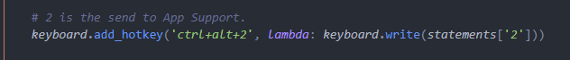
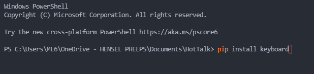
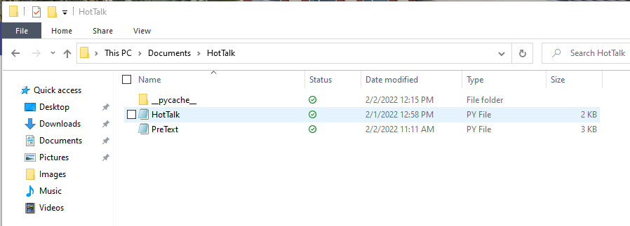

# HotText_App
Automate statements, and commands with hotkeys. You will need to install Python3.9, the keyboard module, and VSCode. VsCode and Python3.9 can be installed form the Microsoft Store.

## HotKeys
As it is coded now you have to hit the corresponding number with a `ctrl+alt` to activate the statements. Example: `ctrl+alt+3`.

## HotTalk
HotTalk.py is the main script. The needed pip module to import to you computer is: `pip install keyboard`. Type this into powershell after Python3 is installed.

## PreText
PreText.py is the dictionary file for the main script file HotTalk.py, make sure the both stay in the same folder.

## Install/Run Instrustions
Dowload a zip folder from the Code button.

(A video will be placed here soon)
